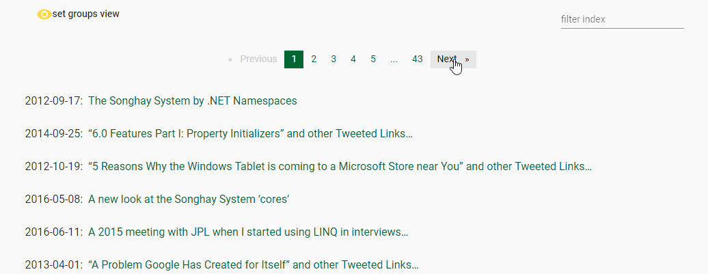

# Songhay Angular workspace

_Angular workspace of shared libraries and ‘studio floor’ client_

The intention here is to share Angular-based code among studio Angular projects. [The research](https://github.com/BryanWilhite/nodejs/tree/master/angular-workspace-minimal) on how to structure this workspace and projects starts in my `nodejs`, self-education repo.

The miserable details around how to get the Angular library actually working in the 6–7.x time-frame are here: <https://github.com/BryanWilhite/Songhay.Dashboard/issues/50>

## `@songhay/core` project

[](https://badge.fury.io/js/%40songhay%2Fcore)

[These](songhay/projects/songhay/core) are the core types building on top of the more framework-agnostic `songhay-core` [repo](https://github.com/BryanWilhite/songhay-core). The featured type here is the Observable Data Store, `AppDataStore` [[GitHub](./songhay/projects/songhay/core/src/lib/services/app-data.store.ts)].

:books: API [documentation](https://bryanwilhite.github.io/songhay-ng-workspace/core) is available.

## `@songhay/index` project

[](https://badge.fury.io/js/%40songhay%2Findex)

[This](songhay/projects/songhay/index) is the Songhay System Index App, literally an _index_ for a set of Web resources, defined by the `MenuDisplayItemModel` [[GitHub](https://github.com/BryanWilhite/songhay-core/blob/master/src/models/menu-display-item.model.ts)]. This app supports listing and grouping index items with the `Selectable.map` [[GitHub](https://github.com/BryanWilhite/songhay-core/blob/master/src/models/selectable.ts#L25)] of the `songhay-core`. This app also supports theming.



:books: API [documentation](https://bryanwilhite.github.io/songhay-ng-workspace/index) is available.

## `@songhay/player-video-you-tube` project

[](https://badge.fury.io/js/%40songhay%2Fplayer-video-you-tube)

[This](songhay/projects/songhay/player-video-you-tube) is the library for the YouTube video app of the b-roll player.

:books: API [documentation](https://bryanwilhite.github.io/songhay-ng-workspace/player-video-you-tube) is available.


## initial setup commands

Starting in the root folder of this repo:

```console
ng new songhay --create-application=false --routing=true --style=scss --verbose=true
cd songhay
ng generate library @songhay/core --prefix=rx
npm i moment lodash
npm i @angular/animations @angular/cdk @angular/cdk-experimental @angular/material
ng generate library @songhay/player-video-you-tube --prefix=rx
```

Note that a library-generation command like `ng generate library @songhay/player/video/you-tube --prefix=rx` does not work for CLI >=7.2.3.

Also for studio-specific and historical reasons these commands are also needed:

```console
npm i @angular/http@7.2.0
npm i songhay
```

Finally build the  with the current build script (from the `songhay/` [folder](./songhay)):

```console
npm build
```

@[BryanWilhite](https://github.com/BryanWilhite)
